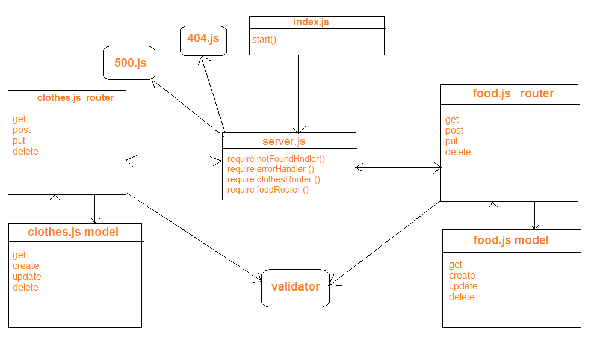

# LAB: Express REST API

# linkes 

[pull-request](https://github.com/anwarshraideh/basic-api-server-/pull/2)
[heroku-deployment](https://anwar-basic-api-server.herokuapp.com/)

# setup

Clone the repo from git hub then run "npm init -y" also run "npm i"and Create .env file  then run "npm start" .

# uml

